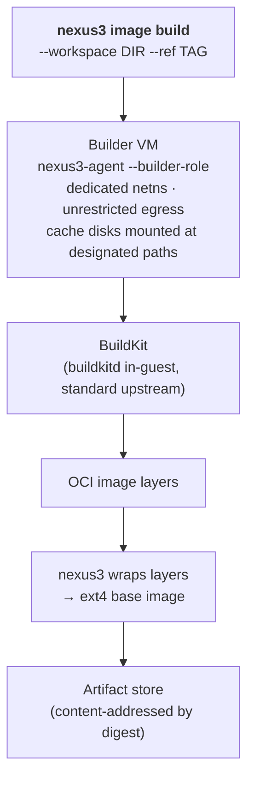

# Images

> An image is a raw ext4 rootfs built by BuildKit inside a dedicated builder VM from a repo-committed `.nexus/Containerfile`.

nexus3 owns zero OCI code. The image format is ext4; the build input is a standard Dockerfile/Containerfile — no custom syntax. The agent binary is baked as the final layer, ensuring agent and host versions always match.

```sh
nexus3 image build --workspace . --ref my-app:latest
nexus3 image ls
nexus3 create my-app --image my-app:latest
```

<Badge type="warning" text="partial" /> — current implementation uses `nexus3 sandbox create`; see [CLI sandbox commands](/cli/sandbox-commands) for the mapping.

## The contract

Every project that wants a custom sandbox image commits a `.nexus/Containerfile` to its repository. The FROM line declares the OCI base; everything else is standard Dockerfile syntax.

The agent binary (`nexus3-agent`) is baked as the **final layer** of every image. This prevents version skew between the in-guest agent and the nexus3 host binary.

Images may also bake a **startup services table** at `/etc/nexus3/services.yaml`. The guest agent reads this table at boot and starts declared services before accepting connections, making `nexus3 create` readiness-gated. <Badge type="danger" text="not built" /> See [Guest agent — startup services](guest-agent.md#startup-services).

## Build path



### Why a builder VM?

A builder VM isolates the build environment from the host and from other sandboxes. It also allows the builder to have unrestricted network egress — for pulling base images and dependencies — while workspace sandboxes run under the egress perimeter's default-deny policy.

The builder VM uses the same `nexus3-agent` binary in `--builder-role` mode. In this role the agent runs the BuildKit lifecycle and exits; it does not start the gRPC control server.

## Cache disks

The builder VM mounts dedicated **cache disks** for the BuildKit layer cache. These are virtio-blk devices persisted across builds. A warm cache turns a minutes-long build into a seconds-long incremental build.

## The two shipped images

nexus3 ships exactly two images:

| Image | Contents |
|-------|----------|
| **Base sandbox image** | Minimal Linux userland + `nexus3-agent` as PID 1. Used by sandboxes that don't supply a `.nexus/Containerfile`. |
| **Agent rebuild image** | The toolchain needed to rebuild `nexus3-agent` itself. Used by the self-hosting build path. |

Every project that needs additional software commits a `.nexus/Containerfile` that extends the base image.

## Guest kernel

The guest kernel is shipped alongside the nexus3 binary, per-arch. It is not part of the OCI image; it is a separate artifact managed by the nexus3 host, so the kernel can be upgraded independently of the rootfs image.

The kernel is built from source with a pinned config (`scripts/kernel/`). Key enabled features: `CONFIG_BRIDGE` + netfilter (for in-guest Docker networking), `CONFIG_VIRTIO_*`, balloon free-page reporting.

## Self-hosting base

The agent rebuild image contains the Go toolchain and the nexus3 source tree. Build path:

1. Launch a sandbox from the rebuild image.
2. Inside the sandbox, `go build ./cmd/nexus3-agent` produces a new agent binary.
3. The host retrieves the binary and bakes it as the final layer of a new base image.

This path is used in CI to keep the agent binary in the shipped images up to date.

## Egress

The builder VM requires **unrestricted egress** and cannot share a workspace sandbox's default-deny posture. The driver provisions the builder VM with a separate network namespace that bypasses the egress perimeter.

## Startup services <Badge type="danger" text="not built" />

An image may bake a services table at `/etc/nexus3/services.yaml`. The guest agent reads this at boot and starts all declared services before opening the vsock control port, making `nexus3 create` readiness-gated.

```dockerfile
# .nexus/Containerfile
FROM nexus3-base
RUN apt-get install -y docker.io
COPY services.yaml /etc/nexus3/services.yaml
```

```yaml
# services.yaml
services:
  - name: dockerd
    command: [dockerd, --storage-driver=overlay2]
    ready: [docker, info]
```

Image-level declarations form the base; create-time `--service` flags on `nexus3 create` can override a same-named entry <Badge type="danger" text="not built" />. See [Guest agent — startup services](guest-agent.md#startup-services) for the full semantics.

## Content addressing

The artifact store addresses images by the SHA-256 digest of the rootfs content (`Envelope.ImageDigest`). Two sandboxes referencing the same digest share the base disk (CoW); each sandbox's writes go to its own sparse overlay.
