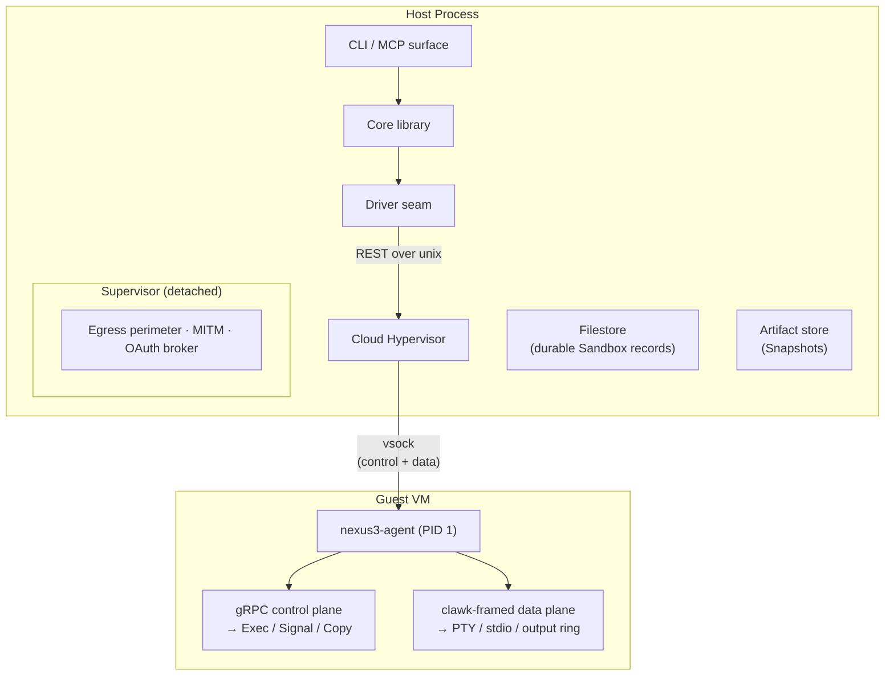

# Sandboxes

> A sandbox is a live Cloud Hypervisor microVM — isolated kernel, memory, and disk — driven by a single Go core.

nexus3 boots, pauses, snapshots, forks, and removes sandboxes. The CLI and MCP server are thin surfaces over the same library core. The governing principle is **primitives, not workflow verbs**.

```sh
nexus3 create my-app --image nexus3-base
nexus3 exec my-app -- go test ./...
nexus3 exec my-app
nexus3 stop my-app
```

<Badge type="warning" text="partial" /> — current implementation uses `nexus3 sandbox create`; see [CLI sandbox commands](/cli/sandbox-commands) for the mapping.

## Pages in this section

| Page | What it covers |
|------|----------------|
| [Sandbox model](sandbox-model.md) | The `Sandbox` entity — the one durable type in nexus3 |
| [Lifecycle states](lifecycle-states.md) | The five states, every legal transition, and what is explicitly illegal |
| [Execution substrate](execution-substrate.md) | Cloud Hypervisor, the `driver` seam, vsock, and the network hook |
| [Guest agent](guest-agent.md) | The in-guest PID-1 agent: control plane, data plane, session reattach |
| [Snapshots and fork](snapshots-and-fork.md) | The `Snapshot` artifact, `fork` fan-out, cost table |
| [Images](images.md) | How a rootfs is built — Containerfile contract, builder VM, shipped images |

## Architecture overview



## Design decisions

- **One entity.** `Sandbox` is the only durable type. There is no separate VM, Project, or Workspace entity.
- **No transient states.** An operation in flight holds a lease alongside the record; the record never enters an intermediate state.
- **Custom agent, not a container runtime.** The agent is a thin Go binary baked into every image. It speaks a narrow bespoke gRPC protocol; it does not implement OCI or any container spec.
- **Zero VMM code.** nexus3 drives Cloud Hypervisor over its REST API. It owns no hypervisor code.
- **Live mounts as source.** <Badge type="danger" text="not built" /> The target source-init model mounts a host `git worktree` directory into the sandbox via virtiofs — bidirectional and live; edits inside appear on the host immediately. Shadow disks absorb write-heavy directories. Fork and snapshot are refused on a live-mounted sandbox; N-way parallelism uses independent `create` calls, each with its own worktree.

## What sandboxes can do

**Build and test.** Full Linux guests with unrestricted shell access. Large Go codebases build and test in-sandbox: `go build ./...` runs clean (`CGO_ENABLED=0`; no C compiler in the guest by default), with cold full-build around 32 seconds and per-package incremental test runs around 2 seconds.

**Source init.** Under the live-mount model <Badge type="danger" text="not built" />, a host `git worktree` directory is mounted directly via virtiofs — edits inside appear on the host immediately, and fork/snapshot are refused on a live-mounted sandbox (see [Snapshots and fork](snapshots-and-fork.md)).

**Nested virtualisation.** `/dev/kvm` is absent inside a guest unless explicitly opted in at sandbox create time (`--nested`). Workloads that boot or manage VMs require it.

**Egress control.** Each sandbox runs under a default-deny egress perimeter — a per-sandbox hostname allowlist with L7 TLS MITM for credential injection, enforced by a detached supervisor that survives CLI exit.

## Library composition

nexus3 ships a thin custom guest agent (no OSS init provided exec/PTY/snapshot-reattach composable with an external microVM substrate) and offloads everything else:

| Concern | Library |
|---|---|
| VM execution (Linux) | Cloud Hypervisor |
| macOS VM execution | Virtualization.framework via `nexus3-vzd` <Badge type="info" text="backlogged" /> |
| Guest networking / egress | gvproxy |
| L7 MITM / TLS | goproxy + clawk CA |
| Image build | BuildKit |
| MCP surface | `modelcontextprotocol/go-sdk` |

## Integration seams

The `driver` seam owns the vsock transport primitive `DialGuest` and a network-hook primitive, and **owns no protocol**. `agent` and `perimeter` are peers of `driver`, not nested inside it. Surfaces (`internal/cli`, `internal/mcp`, out-of-tree plugins) are **thin adapters over `service`** with no surface-to-core RPC.
