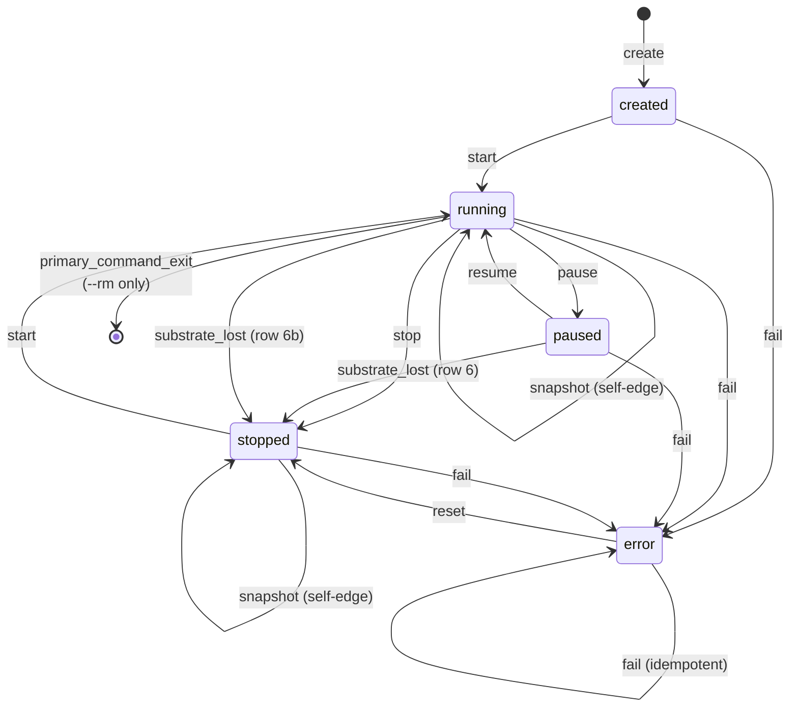

# Lifecycle states

> A sandbox occupies exactly one of five states — there are no transient intermediate values.

An operation in flight holds a lease alongside the durable record; the record never enters a `snapshotting` or `restoring` state. This keeps crash recovery simple: every record is in a stable, well-defined state when the process restarts.

```sh
nexus3 create my-app            # → created
nexus3 start my-app             # → running
nexus3 pause my-app             # → paused
nexus3 resume my-app            # → running
nexus3 stop my-app              # → stopped
```

<Badge type="warning" text="partial" /> — current implementation uses `nexus3 sandbox create`; see [CLI sandbox commands](/cli/sandbox-commands) for the mapping.

## States

| State | Meaning |
|-------|---------|
| `created` | Record minted; no VM running. |
| `running` | VM live and accepting commands. |
| `paused` | VM execution suspended; memory intact in host RAM. A stable, deliberately-held state — not an internal step in snapshot or checkpoint. |
| `stopped` | VM absent; record survives. `StopReason` qualifier is set. |
| `error` | Write-ahead marker present for a crashed destructive operation, or a `fail` trigger received. |

`error` is recoverable. Acknowledge it with `nexus3 recover <id>`, which returns the sandbox to `stopped` for restart or deletion.

## Transition table

> **Create readiness gate** <Badge type="danger" text="not built" />: when a sandbox image declares startup services, `nexus3 create` blocks after the sandbox enters `running` until all service readiness probes pass (30-second cap, then create fails). The state machine does not add a new state for this; the sandbox is already in `running` while probes are polling. See [Guest agent — startup services](guest-agent.md#startup-services).

| # | From | To | Trigger | Initiator |
|---|------|----|---------|-----------|
| 1 | `created` | `running` | `start` | user |
| 2 | `running` | `paused` | `pause` | user |
| 3 | `paused` | `running` | `resume` | user |
| 4 | `running` | `stopped` | `stop` | user |
| 5 | `stopped` | `running` | `start` | user |
| S1 | `running` | `running` | `snapshot` | user (self-edge) |
| S2 | `stopped` | `stopped` | `snapshot` | user (self-edge) |
| 6 | `paused` | `stopped` | `substrate_lost` | system |
| 6b | `running` | `stopped` | `substrate_lost` | system |
| 7 | `created` | `error` | `fail` | system |
| 8 | `running` | `error` | `fail` | system |
| 9 | `paused` | `error` | `fail` | system |
| 10 | `stopped` | `error` | `fail` | system |
| 11 | `error` | `error` | `fail` | system (idempotent) |
| 12 | `error` | `stopped` | `reset` | user |
| 13 | `running` | *(remove)* | `primary_command_exit` | system (`--rm` only) |

## What is explicitly illegal

### `paused → stopped` via `stop`

**Calling `nexus3 stop` on a paused sandbox returns an error.** Row 4 in the table has `running → stopped`; there is no `paused → stopped` row for the `stop` trigger.

A paused sandbox holds its full memory state. Stopping it cleanly requires a resume first:

```sh
nexus3 resume my-app && nexus3 stop my-app
```

The `paused → stopped` edge exists only for substrate loss (trigger `substrate_lost`, row 6) — when the host reboots or the VMM is killed and the memory state is already gone.

### Snapshot from `paused`

Snapshot is a self-edge valid only from `running` (row S1) and `stopped` (row S2). It is not legal from `created`, `paused`, or `error`. A paused VM's memory state cannot be safely snapshotted across all platforms.

### Fork bypasses the table

`TriggerFork` has no entry in the transition table. Fork children are created directly in `running` state by the service layer; the parent sandbox state is unchanged.

### Fork and snapshot on a live-mounted sandbox <Badge type="danger" text="not built" />

When a sandbox holds a live virtiofs mount, two operations are **refused with an explicit error** regardless of sandbox state:

- **`nexus3 fork`** — two child VMs would share one host worktree and collide on `.git/index.lock`.
- **`nexus3 snapshot`** — the mounted tree lives on the host and is not captured in the snapshot, so a restore would resume memory state referencing files that changed underneath it.

The N-way parallel pattern (`nexus3 create` × N, each with its own worktree) is the correct fan-out primitive for live-mounted sandboxes. See [Snapshots and fork](snapshots-and-fork.md).

## State diagram



## The `stop_reason` qualifier

When a sandbox enters `stopped`, a `StopReason` qualifier is written:

- **`clean`** — user-requested stop. The sandbox is safe to restart with `nexus3 start`.
- **`memory_lost`** — substrate loss (host reboot, VMM kill). In-progress work at the time of the event was lost.

`StopReason` is cleared when the sandbox transitions back to `running`.

## Resource governor

A per-sandbox governor runs three control loops while the VM is running:

| Axis | Mechanism | Guard |
|------|-----------|-------|
| Memory | virtio balloon inflate/deflate | Host `MemAvailable` floor |
| vCPU | hot-plug / hot-unplug | None — vCPU has no guard |
| Disk | virtio-blk online resize (no guest reboot) | Host free-space guard |

Telemetry (pressure stall, disk usage, memory stats) arrives from the guest over a dedicated vsock port. The governor polls it and issues resize calls to the driver when the control law fires.

`vmcfg.Resolve` is the single source of truth for all three axes at any moment. The governor does not hold a separate configuration copy.

## Recovery

When a nexus3 process starts, it reconciles durable records against the live VMM state. Sandboxes whose VMM process is absent but whose record shows `running` or `paused` receive `TriggerSubstrateLost`, resolving to `stopped` with `StopReason = memory_lost`. The write-ahead `RemovalMarker` field handles crashed destructive operations — a record with `RemovalMarker = true` is treated as already-removed.
