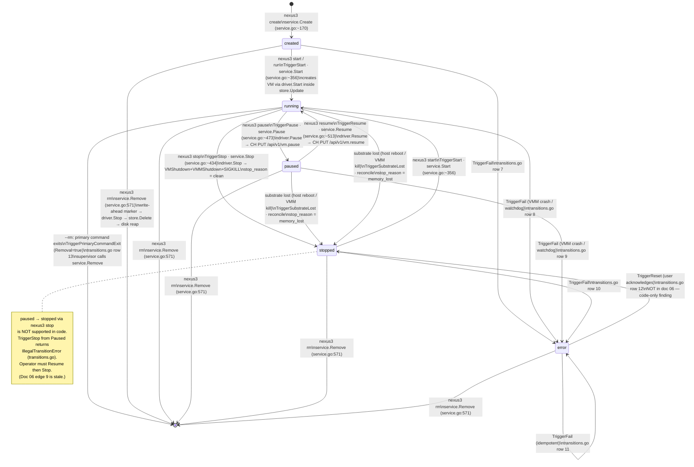
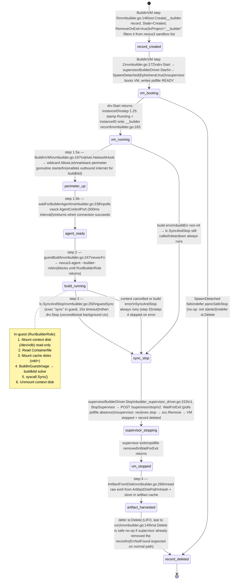

# 13 — State Machines (code-derived)

*Purpose: mermaid stateDiagram-v2 diagrams for every lifecycle in the system, each
transition citing the Go function that performs it. Derived entirely from the live code
as of 2026-08-14. Where a transition exists in doc 06 but is absent from code, or exists
in code but was absent from doc 06, the discrepancy is called out explicitly.*

*Accuracy rule: every state and transition here names the Go function and file:line that
performs it. If a transition could not be traced to code it is marked **UNVERIFIED**.*

### How to verify these citations

Every `file:line` in this document was derived from the live codebase. To re-check any citation:

```shell
# By symbol name (recommended — survives line-number drift):
codegraph explore "<SymbolName>"

# By grep (fallback when codegraph is unavailable):
grep -n "^func.*SymbolName" internal/path/to/file.go
```

**Convention used throughout:** *symbol name* is the stable primary key; *line number* is a convenience hint that rots on every edit. When a citation feels stale, re-derive the symbol with `codegraph explore` and confirm the declaration line matches what the prose describes — not a comment, blank line, or closing brace. To verify a within-function call site (no top-level symbol), open the file at the function's declaration line and scan forward for the described call.

---

## 1 — Sandbox lifecycle

### Code location

Transition table: `internal/core/lifecycle/transitions.go`
State machine evaluator: `internal/core/lifecycle/machine.go:Machine.Next`
Service layer: `internal/core/service/service.go`

### States

| State | Meaning |
|-------|---------|
| `created` | Record minted; no VM running |
| `running` | VM live and accepting commands |
| `paused` | VM execution suspended, memory intact in host RAM |
| `stopped` | VM absent; record survives; `stop_reason` qualifier set |
| `error` | Write-ahead marker present for a crashed destructive operation, or `TriggerFail` received |
| *(gone)* | Record deleted; not a state — shown as `[*]` in diagram |

### Diagram



### Snapshot and fork — self-edges / child-creation

**Snapshot** (`service.Snapshot`, `service.go:794`): self-edge, valid from `running` and `stopped` only. The sandbox stays in its current state; the operation runs under a lease (no transient state). `TriggerSnapshot` is in the code table as `running→running` and `stopped→stopped` (transitions.go rows S1, S2). Not valid from `created`, `paused`, or `error`.

**Fork** (`service.Fork`, `service.go:857`): creates *n* new child sandboxes already in `running` state (driver boots them). The **parent sandbox state is not changed**. `TriggerFork` has no entry in the lifecycle table — the comment in `transitions.go` says "TriggerFork has no entry in the transition table; Machine.Next will return [error] for TriggerFork". Child creation is handled directly in the fork implementation, bypassing the table.

### service.Remove four-step sequence (`service.go:571`)

```
1. store.SetRemovalMarker(ctx, id)          ← write-ahead; crash here → error state on reconcile
2. store.Update → driver.Stop(ctx, id)      ← stops VM inside per-sandbox flock
3. store.Delete(ctx, id)                    ← destroys record + marker atomically
4. ReapDiskCopy(diskDir, id)                ← best-effort; missing file is not an error
```

### Findings vs doc 06

| Finding | Doc 06 claim | Code reality |
|---------|-------------|--------------|
| Edge 9 | `paused → stopped` via `nexus3 stop` | NOT in table. `TriggerStop` only valid from `running`. Returns `IllegalTransitionError` from `paused`. |
| Error producers | "exactly two": write-ahead marker + absent substrate | `TriggerFail` exists from ANY state (rows 7–11). The marker path is one producer; VMM crash/watchdog signals are others. |
| Error exit | Only `nexus3 rm` (edge 12) clears `error` | `TriggerReset` (`error`→`stopped`, row 12) is a second exit path, not mentioned in doc 06. |
| Edge 11 | Listed `nexus3 rm` as co-trigger | `TriggerPrimaryCommandExit` (Removal=true) is a separate code row (13). `nexus3 rm` goes through `service.Remove` which doesn't use the lifecycle table at all. |
| `running`→`error` | "no running→error edge" (reconciliation policy) | Code table has `TriggerFail` from `running` (row 8) for VMM crash paths. The reconciliation policy (marker-over-live-VM = orphan) is still intact but isn't the whole story. |

---

## 2 — Supervisor lifecycle

### Code locations

- Entry point: `cmd/nexus3/supervisor_linux.go:runSupervisorMain` — dispatched from `main()` when `args[0] == "__supervisor"`
- Main loop: `internal/supervisor/supervisor.go:RunDetached` (line 204)
- Spawn: `internal/supervisor/spawn_linux.go:SpawnDetached` (line 122)
- IPC: `internal/supervisor/ipc.go:serveIPC`, `StopSupervisor`

### Supervisor modes

There are two distinct modes sharing the same `RunDetached` function:

| Mode | `Config.Ephemeral` | Used by | Exit trigger |
|------|--------------------|---------|--------------|
| **Persistent** | `false` | `nexus3 orca …` (orca sandbox) | SIGTERM / SIGINT |
| **Ephemeral** | `true` | Builder VM (`supervisorBuilderDriver`) | `POST /supervisor/stop` or parent-watchdog pipe EOF |

### Persistent supervisor diagram

```mermaid
stateDiagram-v2
    [*] --> spawning : SpawnDetached(Ephemeral:false)\nspawn_linux.go:122\nparent CLI holds no watchdog pipe

    spawning --> init : runSupervisorMain → RunDetached\nsupervisor_linux.go:41, supervisor.go:204\nMkdirAll state dir; open store; build CHDriver

    init --> ipc_bound : serveIPC(sockPath)\nipc.go:30 — Unix HTTP listener ready\nstopCh returned; supervisor ready to accept /supervisor/stop

    ipc_bound --> vm_booting : svc.Start(sandboxRef)\nservice.go:~356 → driver.Start\nboots VM via CHDriver (StartNetnsRuntime)

    vm_booting --> vm_running : driver.Start returns instanceID\nstamps Running state onto durable record

    vm_running --> seeding : SeedLoop (background)\nsupervisor.go:SeedLoop\nCA cert + agent creds pushed to guest via vsock

    vm_running --> governor_running : govern.New + go gov.Run\nsupervisor.go:~358 (step 5a)\nwireGovernorAxes attaches CPU + disk axes

    seeding --> ready : pidfile written\nsupervisor.go:~458 (step 6)\nSpawnDetached in parent CLI reads pidfile → returns READY

    ready --> running : awaitShutdown blocks\nsupervisor.go:awaitShutdown:544\nselect on ctx.Done (SIGTERM/SIGINT) or stopCh

    running --> shutdown : SIGTERM or SIGINT\nshutdownBySignal\nOR POST /supervisor/stop → shutdownByStopVerb

    shutdown --> [*] : svc.Stop(sandboxRef)\nservice.go:Stop → record stays alive (State=Stopped)\nVM stopped; pidfile removed (defer)

    note right of running
      Supervisor outlives the CLI.
      Governor loop runs inside
      this goroutine group for the
      full VM lifetime.
    end note
```



### Ephemeral supervisor diagram

```mermaid
stateDiagram-v2
    [*] --> spawning : SpawnDetached(Ephemeral:true)\nspawn_linux.go:122, line 141\npipe created; read-end → fd3 in child\nwrite-end (watchdogW) returned to CLI caller

    spawning --> init : runSupervisorMain → RunDetached\n--ephemeral flag set\n--parent-pipe-fd=3

    init --> watchdog_wired : step 4b — goroutine reads pipe fd\nsupervisor.go:~319\npipeR.Read blocks; EOF → cancel() → awaitShutdown exits

    watchdog_wired --> vm_booting : svc.Start(sandboxRef)\nboots __builder VM

    vm_booting --> vm_running : driver.Start returns

    vm_running --> seeding : SeedLoop (wildcard egress perimeter\nattached in BuildInVM, not here)

    seeding --> ready : pidfile written\nspawn_linux.go parent reads pidfile → SpawnDetached returns (pid, watchdogW, nil)

    ready --> running : awaitShutdown blocks\n\nNormal exit: POST /supervisor/stop → shutdownByStopVerb\nKill exit: CLI exits → watchdogW closed → EOF on fd3 → cancel()

    running --> shutdown_build_done : POST /supervisor/stop\n(from supervisorBuilderDriver.Stop)\nshutdownByStopVerb

    running --> shutdown_watchdog : parent-watchdog pipe EOF\n(CLI SIGKILL'd / exited)\nshutdownBySignal path

    shutdown_build_done --> [*] : svc.Remove(sandboxRef)\nsupervisor.go:~518 (step 8)\nEphemeral: Remove stops VM + deletes __builder record\npidfile removed (defer)

    shutdown_watchdog --> [*] : svc.Remove(sandboxRef)\nsame Remove path; record may already be gone\n(ErrNotFound logged but not fatal)

    note right of running
      watchdogW held open by CLI.
      If CLI is SIGKILL'd:
        OS closes watchdogW →
        pipeR.Read returns EOF →
        cancel() fires →
        awaitShutdown returns
        shutdownBySignal →
        svc.Remove cleans up VM
        and __builder record.
    end note
```

### Findings vs doc 06

Doc 06 mentions "the per-sandbox supervisor owns the removal edge" but contains no description of:
- The supervisor as a detached OS process (`nexus3 __supervisor`)
- Ephemeral mode and the `--ephemeral` flag
- The parent-watchdog pipe (`--parent-pipe-fd`) and its SIGKILL-safety role
- The IPC socket (`supervisor.sock`) and the `POST /supervisor/stop` verb
- The governor being started and hosted inside the supervisor process
- The distinction between `svc.Stop` (persistent) and `svc.Remove` (ephemeral) in the teardown path

All of the above are code-derived facts, not pre-existing doc-06 claims.

---

## 3 — Builder VM lifecycle

### Code locations

- Orchestrator: `internal/core/builder/vmbuilder.go:BuildInVM` (line 117)
- Teardown helper: `internal/core/builder/lifecycle.go:Lifecycle`
- Driver (host side): `internal/cli/builder_supervisor_driver.go:supervisorBuilderDriver`
- In-guest role: `internal/core/agent/builder_role_linux.go:RunBuilderRole`

### Key design invariant

The builder VM uses an **ephemeral supervisor** (`Ephemeral:true`). The CLI side holds `watchdogW`; the supervisor holds the read end. If the CLI is SIGKILL'd, `watchdogW` closes, the supervisor reads EOF, and calls `svc.Remove` to clean up the `__builder` record and stop the VM.

### Diagram



### Findings vs doc 06

Doc 06 makes no mention of the builder VM. This is an entirely new lifecycle:
- `__builder` project records appear in the store during builds but are filtered from `nexus3 sandbox list` (`service.List` filters `Project == "__builder"`)
- The ephemeral supervisor is the VM owner, not the CLI directly
- Failure in any step (boot, build, sync, harvest) still runs teardown via `Lifecycle.panicSafeStop`

---

## 4 — Resize governor

### Code locations

- Governor struct and memory axis: `internal/core/govern/memory.go`
- Main poll loop: `internal/core/govern/loop.go:Governor.Run` (line 142)
- CPU axis: `internal/core/govern/cpu.go`
- Disk axis: `internal/core/govern/disk.go`
- Driver actuators: `internal/core/driver/cloudhypervisor/driver_resize.go`
- Config resolution: `internal/core/vmcfg/vmcfg.go:Resolve`
- Hosting: `internal/supervisor/supervisor.go` step 5a (`govern.New` + `go gov.Run`)
- Boot config: `vmcfg.Resolve` → `Result.PID1Args` = `" --mem-ceiling=<bytes>"`

### Key invariant (D-DC-30, 2026-08-14)

Auto-resize is **unconditional**. The old `--auto-resize` / `--no-auto-resize` CLI flags are deleted. Every sandbox VM receives a VirtioMem hotplug region at boot. The governor is in **passive mode** (no resizes) when `GovBounds.MemMinBytes == 0 || GovBounds.MemMaxBytes == 0`; this is the skip gate in `loop.go:148`.

### vmcfg.Resolve — single source of truth (`vmcfg.go:81`)

```
Input:  BootMemMiB (default 512)  · BootVCPUs (default 1)
        MemMaxMiB (0 → max(4×boot, 4096 MiB))
        VCPUsMax  (0 → max(4×boot, 4))
        DiskMaxGiB (0 → 100 GiB)

Output: Bounds{MemMin=boot, MemMax, VCPUMin=boot, VCPUMax, DiskMax}
        MemoryMaxMiB  → driver.Config.MemoryMaxMiB (sizes VirtioMem region)
        VCPUMax       → driver.Config.VCPUMax
        PID1Args      → " --mem-ceiling=<bytes>" (after "--" in kernel cmdline)
```

### Memory axis control law (`memory.go`)

```
Boot delay:       10 s after VM start (memoryResizeBootDelay)
Nominal interval: 5 s  (memoryEvalInterval)
Fast-poll:        2 s when last sample shows grow pressure (memoryPressurePollInterval)

Grow trigger:
  PSI present:    some_avg10 ≥ 10.0  (psiGrowPressure)
  PSI absent:     MemAvailable/MemTotal ≤ 0.20  (defaultGrowThreshold)
  Critical bypass:MemAvailable/MemTotal ≤ 0.08  (bypasses grow cooldown)
  Consecutive:    1 sample suffices (memoryGrowConsecutive = 1, EAGER)
  Cooldown:       60 s (memoryGrowCooldown)
  Step:           25% of current RAM, minimum 256 MiB

Shrink trigger:
  MemAvailable/MemTotal > growThreshold for 5 consecutive samples (memoryShrinkConsecutive)
  Cooldown:       120 s (memoryShrinkCooldown)
  Step:           12.5% of current RAM, minimum 512 MiB
```

### CPU axis control law (`cpu.go`)

```
Grow trigger:  some_avg10 ≥ 15.0 for 0 s sustained (cpuGrowConsecutive=1, EAGER; cpuGrowWindow=0)
               Cooldown: 60 s
               Step: +1 vCPU up to VCPUMax

Shrink trigger: some_avg10 < 2.0 for 20 s sustained (cpuShrinkWindow = 4×5s)
               Cooldown: 120 s
               Step: -1 vCPU down to VCPUMin
```

### Disk axis control law (`disk.go`)

```
Boot delay:    15 s (diskBootDelay)
Grow trigger:  DiskUsed/DiskTotal > 0.80 (diskGrowThreshold)
               Cooldown: 30 s (diskGrowCooldown)
               Step: +16 GiB (diskGrowStep)
               Ceiling: min(Bounds.DiskMaxBytes, 100 GiB)
Shrink:        NEVER (disk shrink not supported at runtime)
Gate:          Only active when HasWorkspaceDisk=true AND Bounds.DiskMaxBytes > 0
               (wireGovernorAxes in supervisor.go:566)
```

### Governor lifecycle diagram

```mermaid
stateDiagram-v2
    [*] --> created : govern.New(Config{Resizer,Telemetry,Bounds})\nwireGovernorAxes (CPU+disk axes attached)\nsupervisor.go step 5a, after svc.Start

    created --> skipped : Bounds.MemMinBytes==0 OR MemMaxBytes==0\nOR MemMinBytes≥MemMaxBytes\nloop.go:148 — logs govern.loop.skipped, returns immediately

    created --> boot_delay : Bounds configured\ngo gov.Run(ctx) — goroutine\nloop.go:155 — 10 s boot delay (memory axis)\n15 s boot delay (disk axis, independent)

    boot_delay --> polling : boot delay elapsed\nloop.go:161 logs govern.loop.started

    polling --> polling : every 5 s (nominal) or 2 s (under pressure)\nloop.go:167\n1. Poll guest telemetry over vsock:3002\n   (resize.TelemetryVsockPort)\n2. Validate sample age (< SampleMaxAge)\n3. For each axis: Evaluate(ctx)\n4. Adapt interval: 2 s if sampleWantsGrow

    polling --> memory_grow : memory axis: PSI≥10 OR avail/total≤0.20\nresizer.ResizeMemory(target)\nCH PUT /api/v1/vm.resize (desired_ram)\ncooldown: 60 s

    memory_grow --> polling : resize complete

    polling --> memory_shrink : memory axis: 5 consecutive idle samples\nresizer.ResizeMemory(target)\ncooldown: 120 s

    memory_shrink --> polling

    polling --> cpu_grow : cpu axis: some_avg10≥15.0 (immediate)\nresizer.ResizeCPU(current+1)\nCH PUT /api/v1/vm.resize (desired_vcpus)\ncooldown: 60 s

    cpu_grow --> polling

    polling --> cpu_shrink : cpu axis: some_avg10<2.0 for 20 s sustained\nresizer.ResizeCPU(current-1)\ncooldown: 120 s

    cpu_shrink --> polling

    polling --> disk_grow : disk axis: used/total>0.80\nresizer.GrowDisk(diskIndex, target)\nCH PUT /api/v1/vm.resize-disk\ncooldown: 30 s

    disk_grow --> polling

    polling --> [*] : ctx.Done() — supervisor shutting down\nloop.go:173 / 225

    skipped --> [*]

    note right of polling
      poll error: deduped; logs once per run.
      stale sample (age > SampleMaxAge):
        logged as govern.sample_stale,
        no resize action taken.
      Host-headroom admission (memory axis only):
        g.headroom.HasHeadroom consulted at
        memory.go:329-330 before each memory grow.
        Governor.headroom = NewProcfsHeadroom()
        wired at govern.New (loop.go:111).
        Disk grows: checkFreeSpace (driver_resize.go:208)
        guards host disk space (not RAM).
        CPU grows: no host resource guard.
    end note
```



### UNVERIFIED items

One correction: the original trace cited `loop.go:47-48` as proof that host-headroom is consulted "before every grow." Those lines are prose inside the `Governor` struct doc comment — not executable code. The actual per-axis picture:

- **Memory grows:** `g.headroom.HasHeadroom` is called at `memory.go:329-330` (inside `if !isShrink`). Reads `/proc/meminfo` MemAvailable via `NewProcfsHeadroom`. Fails conservative — refuses the grow on any read error. This is the only production call site of `HasHeadroom` in the entire `govern` package.
- **Disk grows:** No `HasHeadroom` call in `disk.go` or the governor. Host disk space is checked by `checkFreeSpace` at `driver_resize.go:208` inside `GrowDisk` — a sparse-aware check (actual committed bytes = `stat.Blocks×512`, not apparent size) against host filesystem free space. Protects host disk, not RAM.
- **CPU (vCPU) grows:** No host resource guard of any kind before a vCPU grow. The only gates in `cpu.go:Evaluate` are PSI-support check, cooldown, and bounds clamping.

`Governor.headroom = NewProcfsHeadroom()` wired at `govern.New` (`loop.go:111`) is a valid code citation.

### Findings vs doc 06

Doc 06 contains no mention of:
- The resize governor
- `vmcfg.Resolve` as the single source of truth for VM config
- Auto-resize being unconditional (D-DC-30)
- The PID-1 `--mem-ceiling=<bytes>` argument
- The three-axis (memory / CPU / disk) control laws

All of the above are new code-derived facts.

---

---

*Generated 2026-08-14 from live codebase. Key files: `internal/supervisor/supervisor.go`, `internal/supervisor/spawn_linux.go`, `internal/supervisor/ipc.go`, `internal/core/service/service.go`, `internal/core/builder/vmbuilder.go`, `internal/cli/builder_supervisor_driver.go`, `internal/core/govern/memory.go`, `internal/core/govern/cpu.go`, `internal/core/govern/disk.go`, `internal/core/govern/loop.go`, `internal/core/vmcfg/vmcfg.go`, `internal/core/lifecycle/transitions.go`.*
